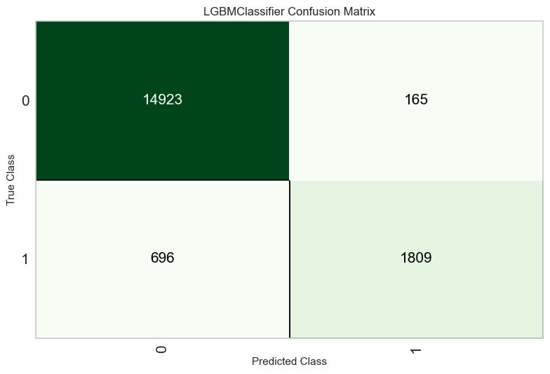
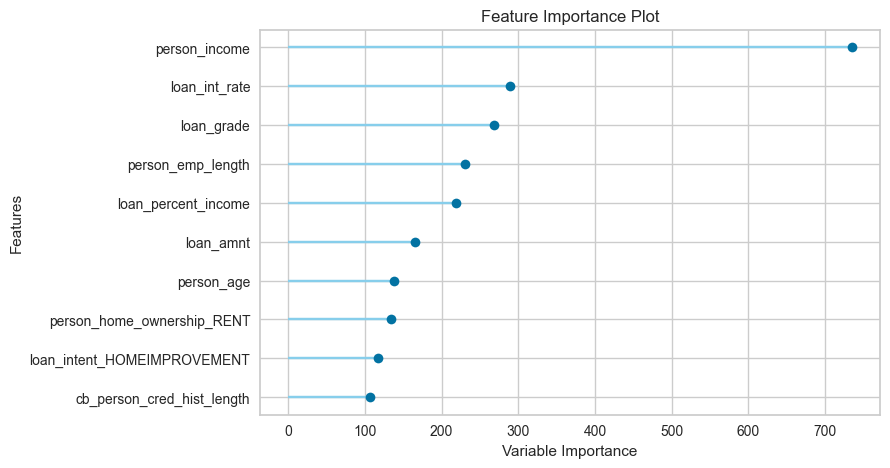
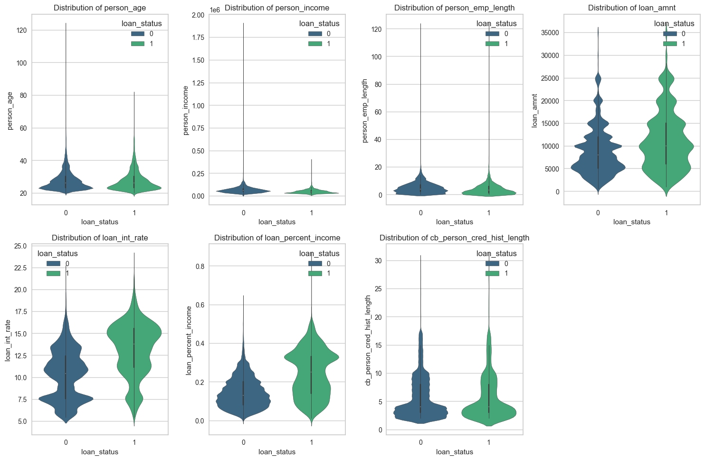
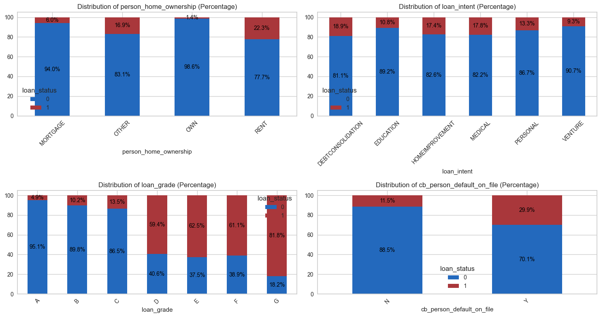

# Loan-Approval-Prediction

This project focuses on predicting loan approvals using machine learning techniques, leveraging the dataset from [Kaggle Playground Series - Season 4, Episode 10](https://www.kaggle.com/competitions/playground-series-s4e10/overview). The dataset contains information about loan applicants, including demographic details, financial history, loan characteristics, and past repayment behavior.

The goal of this project is to develop a predictive model that can assess the likelihood of a loan being approved. Accurately predicting loan approvals can help financial institutions streamline the lending process, reduce manual review efforts, and enhance decision-making efficiency.

## Key Questions

1) What loan characteristics (e.g., amount, interest rate) are most predictive of approval to help financial institutions optimize their portfolios?
2) How can high-risk or suspicious applications be detected early?

## Findings

**Model Performance**
* Best Model: LightGBM
    * Accuracy: 95.21%
    * Precision: 92.15%
    * Recall: 72.57%
    * AUC: 95.34%
    * F1-Score: 81.19%

**Feature Importance**

* Most Influential Features
    * person_income
    * loan_int_rate
    * loan_percentage_income

**Analysis**
* Numerical features are highly skewed

* Insights from categorical features:
    * Loans with lower grades tend to have higher approval rates.
    * Applicants who own a house or have a mortgage tend to have lower approval rates.

**Potential Fraudulent Activities**
* Flagged applicants with inconsistencies in their records

## Methodology

1) **Data Cleaning**

* Corrected inconsistencies in:
    * Fix Age
    * Fix Employment Length
    * Fix Credit History Length
    * Fix Loan-to-Income Percentage Inconsistency

2) **Feature Engineering**

* Encoding:
    * Ordinal encoding for loan_grade
    * One-hot encoding for categorical variables
* Normalization: Applied to numerical features
* Handling Imbalance: Used SMOTE to address class imbalance

3) **Model Building**
* AutoML: PyCaret
* Best performing model: LightGBM

## Recommendations

* **Refine loan approval policies**: Given that income and interest rates are the strongest predictors, financial institutions should reassess their approval criteria to align with these insights.

* **Implement early fraud detection measures**: The flagged inconsistencies in applicant records suggest the need for automated anomaly detection systems to catch fraudulent applications before approval.

* **Improve risk assessment strategies**: The lack of strong correlation between loan amount and approval probability suggests financial institutions may need to reconsider how loan amounts are evaluated in their models.

* **Automate loan approval for low-risk applicants**: Given the high accuracy of the model, automating approvals for low-risk applications could streamline operations and reduce manual review efforts.

* **Periodically retrain the model**: To maintain high performance, the model should be regularly updated with new data to account for market changes and evolving lending patterns.

## Future Work

* **Deeper analysis of flagged fraudulent applications**: Further investigation into the flagged applications could help identify common patterns or risk indicators associated with fraudulent behavior. By leveraging advanced anomaly detection techniques and clustering algorithms, financial institutions can enhance fraud prevention strategies and refine their approval criteria.

* **Integrate loan default data for a more comprehensive risk assessment**: Combining this dataset with loan default records would allow for a dual-layer analysis—predicting both loan approval and the likelihood of default. This would enable financial institutions to optimize lending policies by not only approving loans efficiently but also ensuring that approved loans have a lower risk of default, ultimately reducing financial losses.